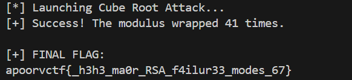

# The Riddler’s Cipher Delight 2

| Field      | Value |
|------------|-------|
| Category   | Cryptography |
| Points     | 405 |
| Solves     | 69 |

## Description

The Riddler wasn't very delighted by the previous challenge. His encryption wasn't as clever as he thought! So, he concocted this new challenge for you.

> Author : accord

## Files

- [chall.py](./chall.py)
- [solve.py](./solve.py)
- [retrpng.png](./retrpng.png)

## Writeup

### Flag

```
apoorvctf{_h3h3_ma0r_RSA_f4ilur33_modes_67}
```

### Executive Summary

A multi-stage crypto/OSINT/esoteric-language challenge chain. Stage 1 cracks a 256-bit RSA private key with Wiener's Attack, yielding a Rentry link. That link leads through Brainfuck, Base64, and Malbolge to a Minisign public key used to authenticate legitimate pastes. After filtering out community troll pastes (no valid Minisign signature), the real Stage 4 script reveals the same RSA modulus reused from Stage 1 — exploited via the reused-modulus trick. The final stage applies a cube root attack (`e=3`, no padding) to retrieve the flag.

### Vulnerability Analysis

The challenge chains five distinct RSA/crypto weaknesses:

1. **Small private key (Wiener's Attack)** — Stage 1 uses `d = getPrime(256)` with a 1024-bit modulus, making `d` dangerously small relative to `N`.
2. **Reused Modulus** — Stage 4's `N` is identical to Stage 1's. Since Stage 1 already yielded `d`, the prime factorisation of `N` was already known.
3. **Textbook RSA, e=3 (Cube Root Attack)** — The final stage uses `e = 3` with no padding on a short message. Because `m^3 < N`, the ciphertext `c = m^3` exactly, so a simple integer cube root recovers `m`.
4. **Obfuscated parameters (XOR with 10-bit prime)** — Stage 4 XOR-obfuscates `N`, `e`, `c` with a small prime `l`; brute-forcing 10-bit primes trivially reverses it (`l = 971`).
5. **Troll pastes** — Community-made fake Rentry pastes with broken or mismatched RSA parameters; defeated by verifying the Minisign signature against the recovered public key.

### Exploit Strategy

**Stage 1 — Wiener's Attack**

`d = getPrime(256)` with a 1024-bit `N` satisfies the Wiener condition $d < \frac{1}{3} N^{1/4}$. Feed `(e, N)` to `owiener` → instant private key. Decrypt `c` → get link `rentry.co/actf1`.

**Stage 2 — Rabbit Hole (OSINT + Esoteric Languages)**

- `actf1` page source → Brainfuck → Base64 → dead-end message (`"this is a dead end.. or is it ?"`).
- Manually enumerate to `actf3` → Malbolge → Minisign public key:
  `RWQ454fqCYMUjvs8f7Cen3i8dv3xwporJuYHAd+yLjyMAQO2HEcrj2zU`

**Stage 3 — Filtering Troll Pastes**

Other CTF players posted fake pastes (e.g. `actf27`, `thiccattraction`) with script bodies claiming `e = 31290471` at the top but hardcoding `e = 3` inside — clearly broken. Run `minisign -Vm <paste> -P <pubkey>` on each; only the author's paste passes. Ignore all non-verified content.

**Stage 4 — Reused Modulus**

Legitimate paste `lemonyrick67691` has `N`, `e`, `c` XOR'd with an unknown 10-bit prime `l`. Brute-force `l` over all 10-bit primes, recover `l = 971`, un-XOR the parameters. Recognise `N` as identical to Stage 1. Use the known factorisation to compute new `d'` and decrypt → `rentry.co/nakedcitrus21`.

**Stage 5 — Cube Root Attack**

`nakedcitrus21` has `e = 3`, no padding, `c = m^3 mod N`. Because the flag is short, `m^3 < N`, so no modular reduction occurred. Compute $m = \lfloor c^{1/3} \rfloor$ via binary search. If `root^3 == c + k*N` for small `k`, recover `m` directly.

### Implementation

```python
from Crypto.Util.number import long_to_bytes

N =  61335101030478919720870258161372353921031836932008941567053217346527987820466076329261287463549421023809770372764569882735210394312462119856344422486841273928867940096663293663837886684820260400512030980133100917131135731484950367326809489778133379519412767375186265844153579533926857758944406865260292926799
c =  22940309699977793906056877062420112639761767581900180883624329834487505119909951332117055492787889879690909162380572981397616990971145682582277715812733237198794876740691081318300157652208914119477544854893277826277566422100085011803508179920690747948460594038047416895021666000373415917463719352822333151422

def find_invpow(x, n):
    """Binary search to find the exact integer n-th root of x"""
    high = 1
    while high ** n < x:
        high *= 2
    low = high // 2
    while low < high:
        mid = (low + high) // 2
        if low < mid and mid**n < x:
            low = mid
        elif high > mid and mid**n > x:
            high = mid
        else:
            return mid
    return mid + 1

print("[*] Launching Cube Root Attack...")

# Test k wrap-arounds from 0 up to 100,000
for k in range(100000):
    target = c + (k * N)
    root = find_invpow(target, 3)

    if root**3 == target:
        print(f"[+] Success! The modulus wrapped {k} times.")
        flag = long_to_bytes(root)
        print("\n[+] FINAL FLAG:")
        print(flag.decode(errors='ignore'))
        break

    if k > 0 and k % 10000 == 0:
        print(f"[*] Still searching... checked {k} wrap-arounds.")
else:
    print("[-] Attack failed. The modulus wrapped too many times.")
```

### Execution & Results




