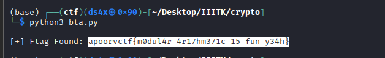

# Beneath the Armor

| Field      | Value |
|------------|-------|
| Category   | Forensics |
| Points     | 481 |
| Solves     | 31 |

## Description

"History repeats itself, even for ironman, life goes on cycles"

files: https://drive.google.com/drive/folders/1j5WNuxIk0C30_wE30aM_JiALF3n3lLoV?usp=sharing

> Author : nnnnn

## Files

- [chall4.png](./chall4.png)
- [solve.py](./solve.py)
- [retrflg.png](./retrflg.png)

## Writeup

### Flag

```
apoorvctf{m0dul4r_4r17hm371c_15_fun_y34h}
```

### Executive Summary

A custom LSB steganography challenge where hidden bits are extracted using a cyclic "staircase" pattern across RGB channels rather than the standard linear LSB method. Automated tools (binwalk, zsteg, steghide) all came up empty because they scan bit-planes uniformly. A targeted Python script extracting bit 0 from Red, bit 1 from Green, and bit 2 from Blue — per pixel — recovered the flag.

### Initial Triage

Standard forensic suite came up empty:

- `file chall4.png` — valid 1920×1076 PNG, nothing unusual.
- `strings chall4.png` — no flag or base64 blobs.
- `binwalk -e chall4.png` — only the standard PNG header and zlib-compressed data; no nested files.
- `exiftool` — clean metadata.
- `steghide`, `zsteg`, `outguess` — no hits with default settings.

### Vulnerability Analysis

The challenge hint — *"life goes on cycles"* — is the key. Standard stego tools extract bits linearly: bit 0 of R, bit 0 of G, bit 0 of B, repeated for every pixel. The "cycle" here means the **bit index itself rotates** as you step through the three channels:

| Channel | Bit extracted |
|---------|--------------|
| Red     | Bit 0 (LSB)  |
| Green   | Bit 1        |
| Blue    | Bit 2        |

This interleaved bit-plane scheme is not covered by automated tools like `zsteg`, making a custom extraction script necessary.

### Exploit Strategy

1. Load the PNG and iterate every pixel in raster order.
2. From each pixel, extract one bit per channel using the rotating bit index: `(R >> 0) & 1`, `(G >> 1) & 1`, `(B >> 2) & 1`.
3. Concatenate all extracted bits and group into 8-bit bytes.
4. Decode as ASCII and search for the `apoorvctf{` flag prefix.

### Implementation

```python
from PIL import Image

def solve():
    # Load image and access pixel map
    img = Image.open("chall4.png").convert("RGB")
    pixels = img.load()
    width, height = img.size

    bits = []
    
    # Iterate through pixels to extract the cycled bits
    for y in range(height):
        for x in range(width):
            r, g, b = pixels[x, y]
            
            # The "Cycle": Red bit 0 -> Green bit 1 -> Blue bit 2
            bits.append((r >> 0) & 1)
            bits.append((g >> 1) & 1)
            bits.append((b >> 2) & 1)

    # Reconstruct bits into bytes
    extracted_data = bytearray()
    for i in range(0, len(bits), 8):
        byte_bits = bits[i:i+8]
        if len(byte_bits) < 8: break
        
        # Binary to Integer conversion
        byte_val = 0
        for bit in byte_bits:
            byte_val = (byte_val << 1) | bit
        extracted_data.append(byte_val)

    # Search for flag format
    final_string = extracted_data.decode('ascii', errors='ignore')
    if "apoorvctf" in final_string:
        print(f"[+] Flag Found: {final_string[final_string.find('apoorvctf'):final_string.find('}')+1]}")

if __name__ == "__main__":
    solve()
```

### Execution & Results




