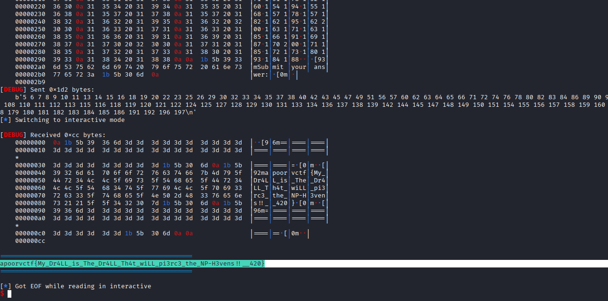

# NP Harder

| Field      | Value |
|------------|-------|
| Category   | Miscellaneous |
| Points     | 402 |
| Solves     | 71 |

## Description

After drilling his whole life, Simon wanted something really hard to drill. So, of course, he turned to NP-Hard problems. However, he's a bit stuck, since this requires some Sciency-Fancy stuff for which you need to help him out.

`nc chals2.apoorvctf.xyz 14001`

> Author : accord

## Files

- [drillthis.png](./drillthis.png)
- [solve.py](./solve.py)
- [retrflg.png](./retrflg.png)

## Writeup

### Flag

```
apoorvctf{My_Dr4LL_is_The_Dr4LL_Th4t_wiLL_pi3rc3_the_NP-H3vens!!__420}
```

### Executive Summary

The challenge served a graph over netcat and asked for its **Minimum Vertex Cover** — a classic NP-Hard problem. A naive approximation (networkx) triggered a Rickroll, revealing the server required the exact optimum. Modelling the problem as an **Integer Linear Program (ILP)** with `pulp` gave the exact minimum cover and retrieved the flag.

### Initial Recon

Connected to the server via netcat. It immediately printed a massive edge list beginning with `200 230` — 200 nodes, 230 edges. The provided challenge image ([drillthis.png](./drillthis.png)) showed the graph with several nodes highlighted with thick borders, and the title **"NP Harder"** made the task clear: find the **Minimum Vertex Cover**.

A vertex cover is a set of nodes such that every edge in the graph is incident to at least one node in the set. Finding the *minimum* such set is NP-Hard.

### The Trap (Approximation Fails)

The first attempt used `networkx`'s built-in approximation:

```python
nx.algorithms.approximation.vertex_cover.min_weighted_vertex_cover(g)
```

Two problems surfaced immediately:

1. **Timeouts** — Manually pasting the answer was too slow; the server dropped the connection. I switched to `pwntools` to automate submission.
2. **ANSI Escape Codes** — The server was injecting terminal colour codes (e.g. `\x1b[93m`) into the output, causing `int()` conversions to crash with a `ValueError`. Fixed with a regex strip:

```python
c_raw = re.sub(r'\x1b\[.*?m', '', raw)
```

After fixing both issues and submitting, the server returned a YouTube link — a **Rickroll**. The approximation algorithm produces a valid cover but not necessarily the *smallest* one. The server was performing an exact size check.

### Exploit Strategy — ILP for Exact MVC

Since brute force over 200 nodes is off the table, the problem was modelled as an **Integer Linear Program**:

- **Variable** $x_v \in \{0, 1\}$ for every node $v$ — 1 if the node is in the cover.
- **Objective:** minimise $\sum_v x_v$.
- **Constraint:** for every edge $(u, v)$: $x_u + x_v \geq 1$.

The `pulp` library with its built-in CBC solver handles this exactly and quickly.

### Implementation

```python
from pwn import *
import networkx as nx
import pulp
import re

context.log_level = 'debug'
r = remote('chals2.apoorvctf.xyz', 14001)

r.recvuntil(b'Graph:')
r.recvline()
r.recvline()

raw = r.recvuntil(b'Submit', drop=True).decode('utf-8', 'ignore')
c_raw = re.sub(r'\x1b\[.*?m', '', raw)

e = []
for l in c_raw.split('\n'):
    p = l.strip().split()
    if len(p) == 2 and p[0].isdigit() and p[1].isdigit():
        e.append((int(p[0]), int(p[1])))

g = nx.Graph()
g.add_edges_from(e)

pr = pulp.LpProblem("MVC", pulp.LpMinimize)
x = pulp.LpVariable.dicts("x", list(g.nodes()), cat='Binary')

pr += pulp.lpSum([x[i] for i in g.nodes()])

for u, v in g.edges():
    pr += x[u] + x[v] >= 1

pr.solve(pulp.PULP_CBC_CMD(msg=False))

a = sorted([v for v in g.nodes() if pulp.value(x[v]) == 1.0])
ans = " ".join(map(str, a))

r.sendlineafter(b'answer:', ans.encode())
r.interactive()
```

### Execution & Results

The ILP solver found the exact minimum vertex cover instantly. The script submitted the space-separated node list, bypassed the Rickroll, and the server returned the flag.



