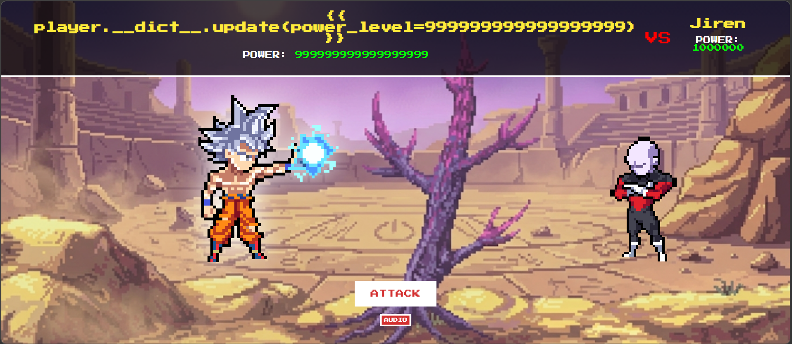
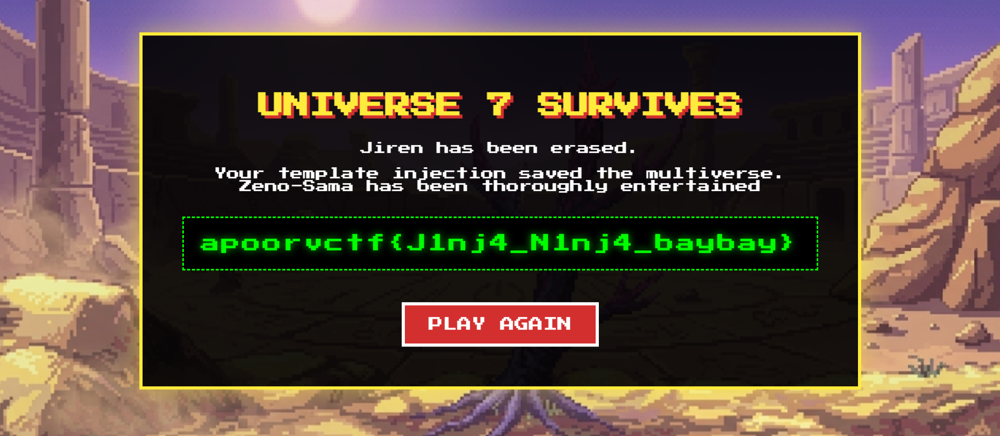

# KameHame-Hack

| Field      | Value |
|------------|-------|
| Category   | Web Exploitation |
| Points     | 236 |
| Solves     | 112 |

## Description

You’re a low-class warrior standing in the path of a God. In this arena, "hard work" is a lie told to those destined to lose. If you want to survive Jiren’s erasure, you’ll have to stop playing by the rules and start rewriting your own stats.

Your pride won't save you, but a well-placed injection might. Break the simulation or be deleted.

http://chals1.apoorvctf.xyz:3001

> Author : Syking

## Files

- [payload.png](./payload.png)
- [retrflg.png](./retrflg.png)

## Writeup

### Flag

```
apoorvctf{J1nj4_N1nj4_baybay}
```

### Executive Summary

A Dragon Ball Z-themed web challenge combining Jinja2 SSTI with a deliberate troll. The server filters standard quote characters and throws a fake PHP/MySQL error to lure players into an SQLi rabbit hole. The real exploit requires a quote-less Jinja2 payload that calls `player.__dict__.update(power_level=999999999999999999)` using kwargs syntax, overwriting the session's power level and winning the fight against Jiren to get the flag.

### Vulnerability Analysis

**Server-Side Template Injection (Jinja2)** — The fighter name input is rendered directly inside a Jinja2 template. The `player` object is available in template context, exposing its `__dict__` and allowing arbitrary attribute mutation.

**WAF / Fake SQLi Trap** — The server filters single and double quotes. Any payload containing them triggers a fake `mysqli_sql_exception` PHP error response. A 1px hidden text in the error page reads:
> `wrong injection type. how does your name get rendered?`

This confirms the intended path is SSTI, not SQLi.

### Exploit Strategy

**Step 1 — Reconnaissance**

The HTML source reveals two hints:
- An HTML comment in `<head>` identifying Jinja2 and naming the template context object `player`.
- A JS comment in the arena stage: `// "A Saiyan's true power is stored within. To surpass a God, one must update() their inner __dict__ionary."`

**Step 2 — Identifying the WAF**

The natural first payload `{{ player.__dict__.update({'power_level': 999999999999999999}) }}` contains quotes and triggers the fake PHP error. Checking the error page source exposes the hidden troll hint and confirms the real vulnerability is SSTI.

**Step 3 — Quote-less Payload**

Python's `dict.update()` accepts keyword arguments, so string keys can be passed without any quotes:

```
{{ player.__dict__.update(power_level=999999999999999999) }}
```

No quotes → WAF bypassed → Jinja2 executes the update → `player.power_level` is set to a massive integer. The template renders an empty string for the name (`.update()` returns `None`) but the session stat is permanently overwritten.

**Step 4 — Trigger the Win**

Submit the payload as the fighter name. Then click **ATTACK** in the arena. The `/attack` endpoint compares the updated `power_level` against Jiren's, detects an instant win, and returns the flag.

### Execution & Results

Payload submitted:



Flag retrieved:




